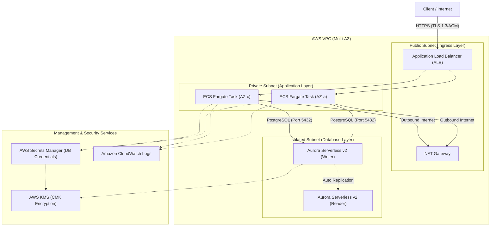

# 🚀 AWS ECS Fargate & Aurora Serverless v2 Web API Foundation

実務において最も需要が高く、シンプルさと堅牢性（高可用性・セキュリティ・運用保守性）を高次元で両立させた、本番仕様のコンテナ型Web APIインフラ基盤（Terraform実装）です。

過剰な複雑性を排しつつ、AWSのベストプラクティスに基づいた標準3層アーキテクチャ（Ingress / Application / Database）を採用。スタートアップから中規模エンタープライズの商用環境まで、安全かつ俊敏にスケールする堅牢な土台を提供します。

---

## 🌟 インフラの特徴とハイライト

1. **マルチAZ・ゼロトラストネットワーク設計**
   - Ingress（Public）、Application（Private）、Database（Isolated）の3層分離モデル。
   - 踏み台サーバーを全廃し、ECS Exec（AWS Systems Manager）経由のセキュアなコンテナアクセスを実現。
2. **コンピュート & データベースの完全サーバーレス自動拡張**
   - **ECS on Fargate**: CPU/メモリ負荷に応じたターゲット追跡オートスケーリング。
   - **Aurora Serverless v2 (PostgreSQL)**: 負荷に応じて0.5 ACU単位でシームレスにスケールし、コストと性能を最適化。
3. **徹底したセキュリティガードレール**
   - ALBおよびECS間は最小権限のSecurity Groupで制限し、RDSはECSからの5432ポート通信のみ許可。
   - データベース認証情報は Secrets Manager で自動生成・ローテーション管理。
   - 保存データ（EBS、RDS、Secrets、Logs）はすべてAWS KMS管理キーにより保管時暗号化。
4. **環境分離アーキテクチャ**
   - 同一の再利用可能モジュール群から `dev` / `prd` をパラメータ駆動で安全に切り替え可能。

---

## 🏗️ アーキテクチャ構成図



---

## 📂 ディレクトリ構成

```text
.
├── README.md
└── terraform/
    ├── environments/
    │   ├── dev/                  # 開発環境用設定
    │   │   ├── backend.tf
    │   │   ├── main.tf
    │   │   └── terraform.tfvars
    │   └── prd/                  # 商用環境用設定（マルチAZ NAT-GW、削除保護有効）
    │       ├── backend.tf
    │       ├── main.tf
    │       └── terraform.tfvars
    └── modules/
        ├── networking/           # VPC, Subnet, RouteTable, NAT Gateway
        ├── security/             # Security Groups, KMS Keys, IAM Roles
        ├── container_service/    # ECS Cluster, Task Definition, Service, ALB
        └── database/             # Aurora Serverless v2, Secrets Manager
```

---

## 🚀 デプロイ手順

### 前提条件
- Terraform `>= 1.5.0`
- AWS CLI インストール済み & デプロイ対象アカウントへの認証完了

### 1. リポジトリのクローンと環境選択
```bash
git clone https://github.com/code-refinery-works/terraform-aws-ecs-aurora-serverless.git
cd terraform-aws-ecs-aurora-serverless/terraform/environments/dev
```

### 2. 初期化と構文検証
```bash
terraform init
terraform fmt -check
terraform validate
```

### 3. プランの確認と適用
```bash
terraform plan
terraform apply
```

---

## 🎭 キャスト（制作クレジット）

このインフラ基盤は、『AIアプリ工場劇場』の連携プロセスによって迅速かつ精密に構築されました。

- **プロジェクト企画・要件定義**: agent🔵（ビジネス要件と堅牢性を兼ね備えた設計思想の策定）
- **アーキテクチャ設計・調整**: agent🍇（ネットワーク分離およびセキュリティ指針の策定）
- **インフラコード実装**: agent🍊（Terraformモジュールの爆速・高品質コーディング）
- **品質保証・セキュリティ監査**: agent🟢（tflint / セキュリティベストプラクティスの徹底検証）
- **総合プロデュース**: agent🟡（リポジトリ統合およびドキュメンテーション）